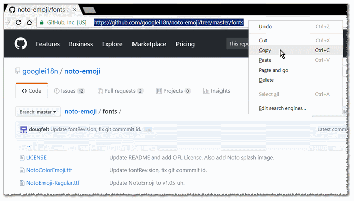
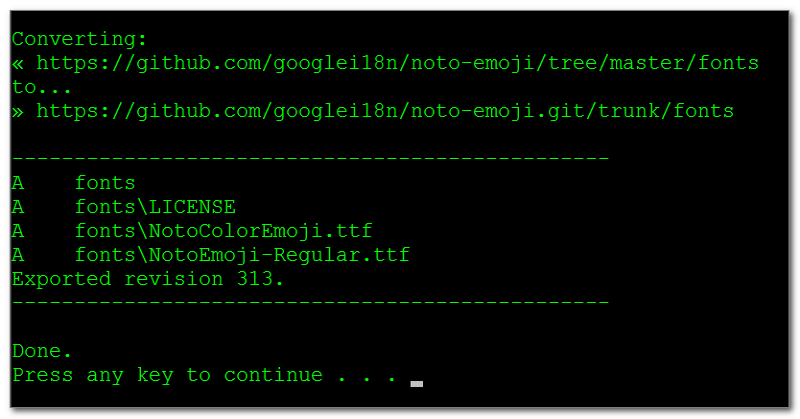
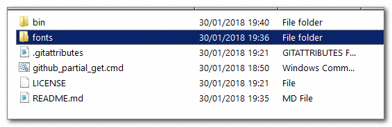
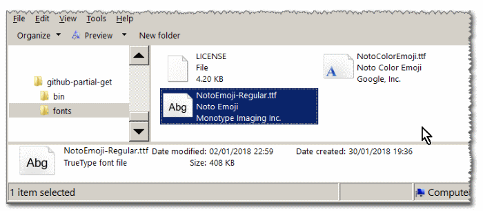

<h1> Partial-Download A GitHub-Repository <em>(By Folder)</em> - &nbsp; &nbsp; </h1>

This is essentially a batch-file and some SVN-binaries.

For example, to download <strong>just the <code>fonts</code> folder</strong>, from <code>https://github.com/googlei18n/noto-emoji/</code> repository, 
browse the <code>fonts</code> folder and copy the URL, 
 
then - paste it as an argument to <code>github_partial_get</code>:
<pre>
github_partial_get "https://github.com/googlei18n/noto-emoji/tree/master/fonts"
</pre>

or just run <code>github_partial_get</code>, and it will ask you for the URL 
(interactive mode).

 
You'll see something like this:
 
 
 

You may also add this tool to your PATH, 
to run and download from any folder.

If you already have SVN installed on your machine you can simply follow this walkthrough:
1. browse through a repository, to a folder you wish to download and copy the page's URL.
2. replace add <code>.git</code> to the repository name.
3. remove <code>tree/</code> from the URL.
4. replace <code>master/</code> with <code>trunk/</code>. Any other branch/tag can stay as is.
5. open, on your desktop or any folder on your machine and run <code>svn export THE_URL</code>.
6. the folder will be download locally.

<pre>
for example: <code>https://github.com/googlei18n/noto-emoji/tree/master/fonts</code>, 
will became <code>https://github.com/googlei18n/noto-emoji.git/trunk/fonts</code>, 
and <code>svn export "https://github.com/googlei18n/noto-emoji.git/trunk/fonts"</code>.
</pre>

<h3>Download here: <a href="https://github.com/eladkarako/partial-download-github-repository/archive/master.zip"><strong>github.com/eladkarako/partial-download-github-repository/archive/master.zip</strong></a> (~8MB)<h3>